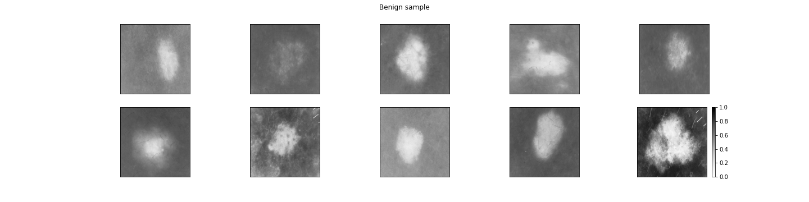
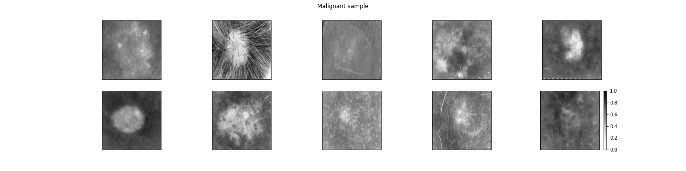
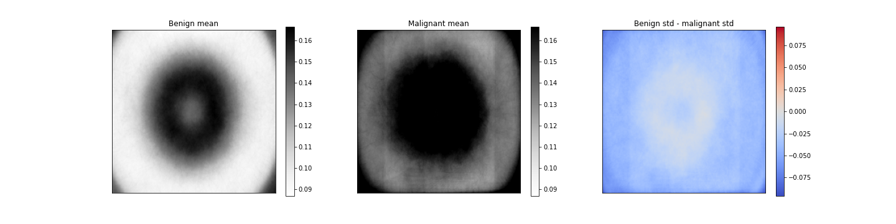

# Logistic regression on images and why it can (accidentally) work

This mini project was motivated by seeing in [this notebook](https://www.kaggle.com/wrecked22/skin-cancer-detection-using-cnn-83-31-accuracy) that one of the simplest classification models, logistic regression on raw image features, gives on-par performance with vanilla CNNs. We'll look into why this might be the case. 

The data comes from [Kaggle](https://www.kaggle.com/fanconic/skin-cancer-malignant-vs-benign), originally sourced under the [ISIC competitions](https://www.isic-archive.com/#!/topWithHeader/tightContentTop/challenges). Here is a sample from our training data:

**TLDR**: Logistic Regression achieves 71% test accuracy on the malignant/benign classification task out of the box, based on b/w images and balanced data. To investigate how is this possible, we look at various pixel statistics and feature importances and arrive at the conclusion that pixel intensity at the corner of the images provide a strong predictor for the target.

